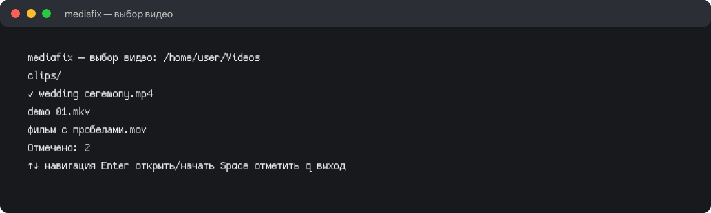
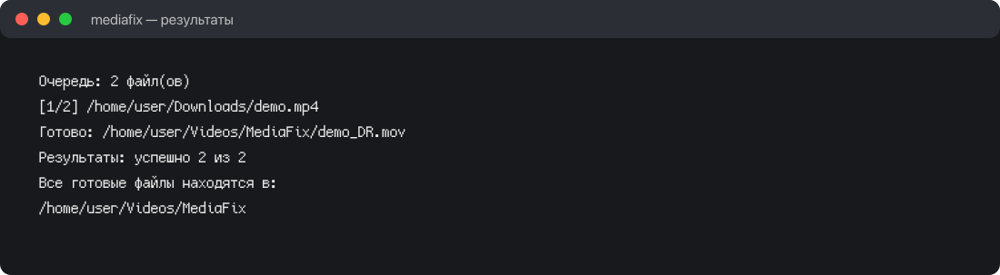

# mediafix

[English version](README.md)

Небольшая терминальная утилита для подготовки видео к DaVinci Resolve. Видео копируется без перекодирования, а каждая аудиодорожка отдельно преобразуется в несжатый PCM 24-bit little-endian, 48000 Гц.



## Возможности

- сохраняет видеокодек, разрешение, FPS, качество, порядок потоков и временные метки;
- сохраняет отдельные аудиодорожки и количество каналов;
- по возможности сохраняет язык и названия дорожек;
- складывает результаты в `~/Videos/MediaFix`, оригиналы не изменяет;
- показывает настоящий прогресс FFmpeg, скорость, очередь, полные пути и ошибки;
- сообщает о субтитрах, вложениях и дополнительных видеопотоках;
- не перекодирует несовместимое видео автоматически.



Проверка результата через `ffprobe` не гарантирует импорт в DaVinci Resolve. Поддержку исходного видеокодека нужно проверить в самой монтажке.

## Простая установка

Требуются Linux, Python 3, `ffmpeg` и `ffprobe`:

```bash
sudo pacman -S ffmpeg
cd /home/mixad/mediafix
git pull
./install.sh
export PATH="$HOME/.local/bin:$PATH"
```

Установщик копирует один Python-файл в `~/.local/share/mediafix` и создаёт команду `mediafix` в `~/.local/bin`. Python-пакеты глобально не устанавливаются.

Установщик также добавляет пункты в файловые менеджеры:

- Nautilus: правой кнопкой по выбранным видео → `Scripts` → `Prepare with mediafix`;
- Dolphin: правой кнопкой по выбранным видео → `Подготовить для DaVinci Resolve (mediafix)`.

Откроется терминал, все выбранные файлы попадут в одну очередь, а после отчёта окно закроется через 5 секунд или сразу после нажатия любой клавиши. Если пункт не появился, перезапустите Nautilus или Dolphin.

Поддерживаются Kitty, Alacritty, GNOME Terminal, Konsole, foot и xterm.

## Запуск

```bash
mediafix
mediafix "video.mp4" "video 2.mkv"
```

Без аргументов откроется выбор файлов:

1. Стрелками выберите папку и нажмите `Enter`.
2. Нажмите `Space`, чтобы отметить видео.
3. Нажмите `Enter`, чтобы запустить очередь.
4. `Backspace` поднимает на уровень выше, `q` выходит.

Результаты сохраняются в `~/Videos/MediaFix` под именем `имя_DR.mov`. Готовые файлы не перезаписываются, при совпадении добавляется числовой суффикс.
